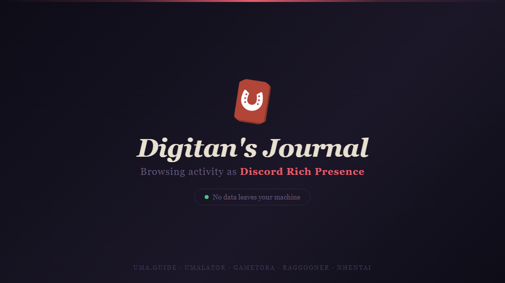

# Digitan's Journal



A browser extension that shows what you're browsing as Discord Rich Presence. Supports **Chrome** (Manifest V3), **Firefox** (Manifest V2), and other Chromium-based browsers (Edge, Brave, Vivaldi).

## Architecture

```
Extension (MV3 Chrome / MV2 Firefox) ↔ Native Messaging (stdin/stdout) ↔ Host Process (Node.js or standalone binary) ↔ Discord RPC (IPC)
```

The extension talks to a local host process over Chrome's native messaging protocol. No WebSocket server, nothing to start by hand.

## Building

The build script accepts a `--target` flag:

```bash
npm run build              # Chrome MV3 (default)
npm run build -- --target firefox  # Firefox MV2 (also emits digitans-journal-firefox-v*.xpi)
```

For Chrome, the polyfill is inlined into bundles. For Firefox, the manifest loads `browser-polyfill.js` as a separate script entry.

**`dist/` is the extension.** It is generated, not committed, and wiped and rebuilt on every run, so run the build before loading it. The manifest at the repo root is only a source template: `content_scripts` and `host_permissions` are generated from `sites.json`, and its paths are relative to `dist/`, so the root folder cannot be loaded on its own.

## Installation

### 1. Install dependencies

```bash
npm install
cd native-host && npm install
```

### 2. Build

```bash
npm run build
```

This populates `dist/`, which is what you load in the next step.

### 3. Load the extension

- **Chrome / Edge / Brave / Chromium:** Go to `chrome://extensions`, enable Developer Mode, click "Load unpacked", select the **`dist/`** folder
- **Firefox / Zen / Gecko** (temporary): Build with `--target firefox`, then go to `about:debugging#/runtime/this-firefox`, click "Load Temporary Add-on…", select `dist/manifest.json`
- **Firefox / Zen / Gecko** (permanent signed add-on): Build with `--target firefox`, then upload the generated `digitans-journal-firefox-v*.xpi` to [addons.mozilla.org](https://addons.mozilla.org) for signing.

### 4. Register the native host (one-time)

```bash
cd native-host
node cli.js --install
```

This writes the native manifest and registers it for Chrome, Edge, Brave, and Chromium. It prints the extension ID it used, which comes from the `key` field in `manifest.json`. Because that key is pinned, the ID is the same on every machine and no matter which folder you loaded the extension from, so there is nothing to detect and nothing to pass in.

**Firefox:**

```bash
node cli.js --install --browser firefox
```

The Gecko add-on ID is `digitans-journal@darkred1145`, read from `manifest.firefox.json`.

To remove the registration and the generated manifests:

```bash
node cli.js --uninstall
```

> **Standalone binary:** If you've built `host.exe` (`npm run build` in `native-host`), run `node cli.js --install` from the `native-host` folder using the bundled Node.js runtime. No separate Node.js install needed.

### 5. Make sure Discord is running

### 6. Visit a supported site

The extension will automatically show your presence on Discord.

## Uninstall

```bash
cd native-host
node cli.js --uninstall
```

Then remove the extension from your browser and delete the project folder.

## Updating

Pull, rebuild, and reload:

```bash
git pull
npm install
npm run build
```

Then click the reload arrow on the extension card in `chrome://extensions`. The native host needs no re-registration: the extension ID is pinned in `manifest.json`, so the registration written the first time keeps matching. If you ever change that `key`, run `node cli.js --install` again from `native-host/`.

## Supported Sites

- gametora.com/umamusume
- raggooneropen.web.app
- uma.guide
- umalator.app

## Configuration

Right-click the extension icon and select "Options" to:

- Enable/disable the extension or specific sites
- Set an idle timeout to auto-clear presence
- Enable privacy mode
- Customize presence text with templates

## Keyboard Shortcut

- `Alt+C` — Clear current activity

## Development

```bash
# Build for Chrome (default). Output lands in dist/
npm run build

# Build for Firefox
npm run build -- --target firefox

# Unit tests
npm test
npm run test:protocol

# E2E test. Builds dist/ first, then loads it in headed Chromium
npx playwright install chromium
npm run test:e2e

# Build standalone host.exe (no Node.js needed after this)
cd native-host
npm run build
```

### Cross-browser compatibility

[webextension-polyfill](https://github.com/mozilla/webextension-polyfill) provides `browser.*` Promise-based APIs in HTML pages (popup, options) and content scripts, loaded as a separate script entry or inlined into bundles.

Background listeners use `chrome.runtime.onMessage` with `sendResponse` directly. Firefox's built-in `chrome.*` compatibility shim handles this, and it avoids the polyfill's listener wrapping, which caused subtle `sendResponse` bridging issues in service worker contexts.
